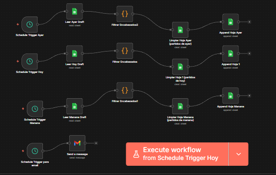
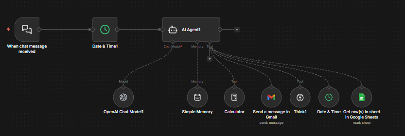
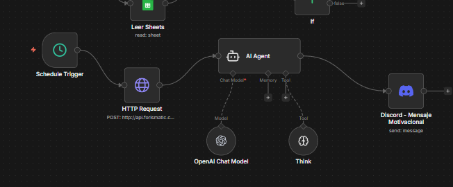
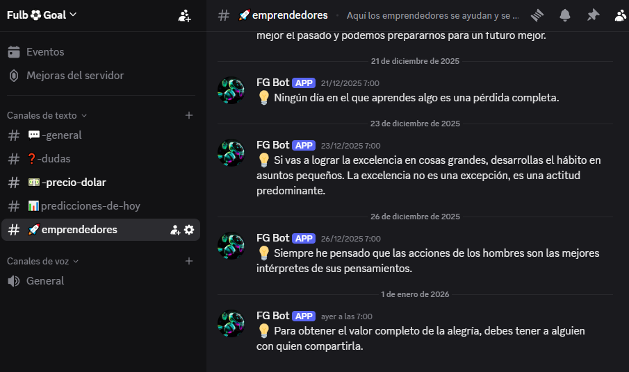

# 🤖 FulboGoal - Sistema de Automatización

Backend automatizado para predicciones de fútbol utilizando **n8n Cloud + Google Sheets + Gmail + Discord**.  
El sistema ejecuta flujos automáticos diarios, expone datos vía webhooks y notifica resultados en tiempo real.

---

## 🏗️ Arquitectura General

Vista general del flujo completo de automatización:

**Flujo principal:**
1. Trigger automático (cron / webhook)
2. Procesamiento en n8n
3. Persistencia en Google Sheets
4. Envío de notificaciones

---

## 🔄 Workflows en n8n

### 📊 Predicciones diarias
Actualización automática de datos cada medianoche.

---

### 🗄️ Google Sheets – Base de datos
Almacenamiento estructurado de:
- Predicciones
- Estadísticas

---

### 📧 Gmail – Reportes automáticos
Envío automático de reportes diarios y alertas.

---

### 🤖 Chatbot Web – Atención automática
Sistema de chatbot integrado en la página web para responder consultas frecuentes y guiar a los usuarios de forma automática.

---

## 🤖 Integración con Discord

### ⚽ Bot de Predicciones de Fútbol
Envía mensajes automáticos con:
- 📊 Predicciones del día

---

### 💵 Bot del Dólar
- Actualización automática del precio del dólar
- Consulta periódica a una API pública de cotización

**Fuente de datos:**
https://cdn.moneyconvert.net/api/latest.json

---

### 💪 Bot de Frases Motivacionales
- Envío diario de frases inspiradoras
- Contenido variado y aleatorio
- Fomenta engagement con la comunidad

**Fuente de datos:**
http://api.forismatic.com/api/1.0/

---

## 📊 Stack Tecnológico
- n8n Cloud (automatización)
- Google Sheets (base de datos)
- Gmail API (notificaciones)
- Discord Webhooks / Bots
- Webhooks REST

---

## 🔐 Seguridad
Por razones de seguridad:
- No se incluyen credenciales reales
- Los IDs, tokens y datos sensibles fueron ocultados o anonimizados

---

## 👤 Autor

**Matías Ferro**
- GitHub: [@Matiasferro19](https://github.com/Matiasferro19)
- LinkedIn: [ferromatias](https://www.linkedin.com/in/ferromatias/)
- Instagram: [@fulbogoal](https://www.instagram.com/fulbogoal/)

---

> Este repositorio contiene únicamente la lógica de automatización y backend.  
> El frontend y la web pública se gestionan en un repositorio separado.

⭐ Si te gustó el proyecto, dale una estrella en GitHub!
